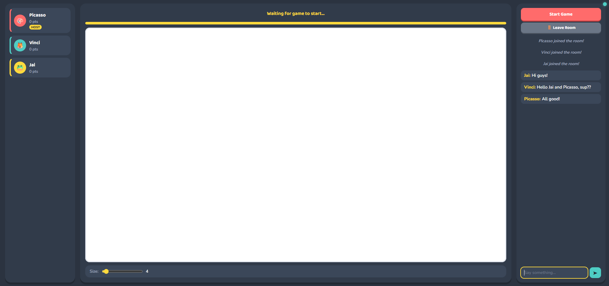
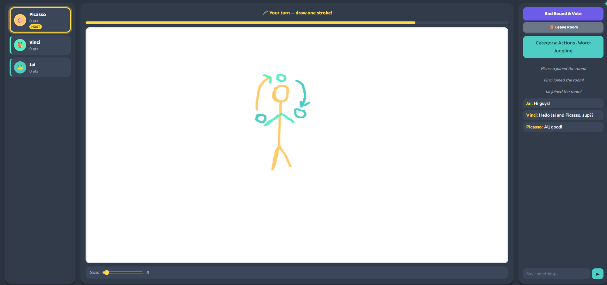
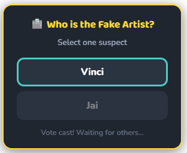
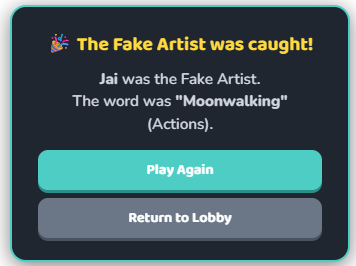

<div align="center">


[](https://python.org) [](https://flask.palletsprojects.com) [](https://socket.io) [](LICENSE) [](https://fakeartist-hp1z.onrender.com)

</div>

---

A real-time multiplayer drawing game inspired by *A Fake Artist Goes to New York*. One player secretly doesn't know the word - everyone draws, then votes to find the fake.

---

## 📸 Screenshots

<div align="center">

| Lobby | Gameplay |
|-------|----------|
|  |  |

| Voting | Reveal |
|--------|--------|
|  |  |

</div>


---

## 🎮 How to Play

1. **Create or join a room** - share the room code with friends
2. **Host starts the game** - a secret word and category are assigned
3. **One player is the Fake Artist** - they see the category but not the word
4. **Everyone draws one stroke per turn** - trying to communicate the word without making it obvious
5. **Host triggers voting** - players vote on who they think the Fake Artist is
6. **Reveal** - if the Fake Artist is caught, real artists win; otherwise the Fake Artist wins

---

## ✨ Features

- 🔴 **Real-time canvas** - live drawing synced across all players via WebSockets
- 🎭 **Hidden roles** - secret word assignment with private role reveal per player
- 🗳️ **Voting system** - in-canvas voting overlay with live vote tracking
- ⏱️ **Turn timer** - 20-second countdown per turn with auto-advance
- 💬 **Live chat** - in-room chat alongside the canvas
- 🎨 **Player colors** - each player gets a unique stroke color
- 🔄 **Canvas history** - late joiners get full stroke replay on connect
- 🚪 **Host migration** - host role passes automatically if the host disconnects

---

## 🛠 Tech Stack

| Layer | Tech |
|-------|------|
| Backend | Python, Flask |
| Real-time | Flask-SocketIO, Socket.IO |
| Frontend | Vanilla JS, HTML5 Canvas, CSS3 |
| Server | Gunicorn + Eventlet |
| Hosting | Render |

---

## 🚀 Running Locally

**Prerequisites:** Python 3.10+

```bash
# Clone the repo
git clone https://github.com/JaiAhuja16/nakli-artist.git
cd nakli-artist

# Install dependencies
pip install -r requirements.txt

# Set environment variable
export SECRET_KEY=your-secret-key

# Run
python app.py
```

Then open `http://localhost:5000` in your browser.

Open multiple tabs to test multiplayer locally - each tab acts as a separate player.

---

## 📁 Project Structure

```
nakli-artist/
├── app.py                  # Flask server + all Socket.IO event handlers
├── requirements.txt        # Python dependencies
├── Procfile                # Render/Gunicorn start command
├── templates/
│   └── index.html          # Single-page game UI
└── static/
    ├── css/
    │   └── style.css       # Full game styling
    └── js/
        └── main.js         # Canvas, socket, and game logic
```

---

## 🔌 Socket.IO Events

<details>
<summary>Click to expand</summary>

| Event | Direction | Description |
|-------|-----------|-------------|
| `join_room` | Client → Server | Join or create a room |
| `leave_room` | Client → Server | Leave current room |
| `start_game` | Client → Server | Host starts a new round |
| `draw` | Client → Server | Broadcast a draw segment |
| `commit_stroke` | Client → Server | Save completed stroke to history |
| `end_turn` | Client → Server | Current player ends their turn |
| `request_voting` | Client → Server | Host triggers voting phase |
| `cast_vote` | Client → Server | Player submits a vote |
| `back_to_lobby` | Client → Server | Host returns room to lobby |
| `update_players` | Server → Client | Sync player list |
| `turn_changed` | Server → Client | Announce next player's turn |
| `your_role` | Server → Client | Private role + word delivery |
| `reveal_results` | Server → Client | Broadcast round outcome |
| `redraw` | Server → Client | Replay full stroke history |

</details>

---

## 🤝 Contributing

Pull requests are welcome. For major changes, open an issue first.

---

<div align="center">


Made by [Jai Ahuja](https://github.com/JaiAhuja16) · IIIT Delhi

</div>